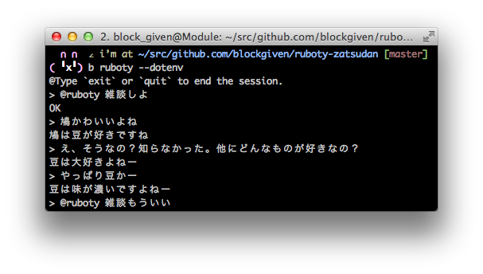

# Ruboty::Zatsudan

ruboty plugin for 雑談.



## Installation

Add this line to your application's Gemfile:

```ruby
gem 'ruboty-zatsudan'
```

And then execute:

    $ bundle

Or install it yourself as:

    $ gem install ruboty-zatsudan


Get docomo api key from:

https://dev.smt.docomo.ne.jp/?p=docs.api.page&api_docs_id=4

And set to `DOCOMO_APIKEY` environment variable.

## Usage

    @ruboty 雑談しよ
    @ruboty 雑談もういい

## Contributing

1. Fork it ( https://github.com/blockgiven/ruboty-zatsudan/fork )
2. Create your feature branch (`git checkout -b my-new-feature`)
3. Commit your changes (`git commit -am 'Add some feature'`)
4. Push to the branch (`git push origin my-new-feature`)
5. Create a new Pull Request
